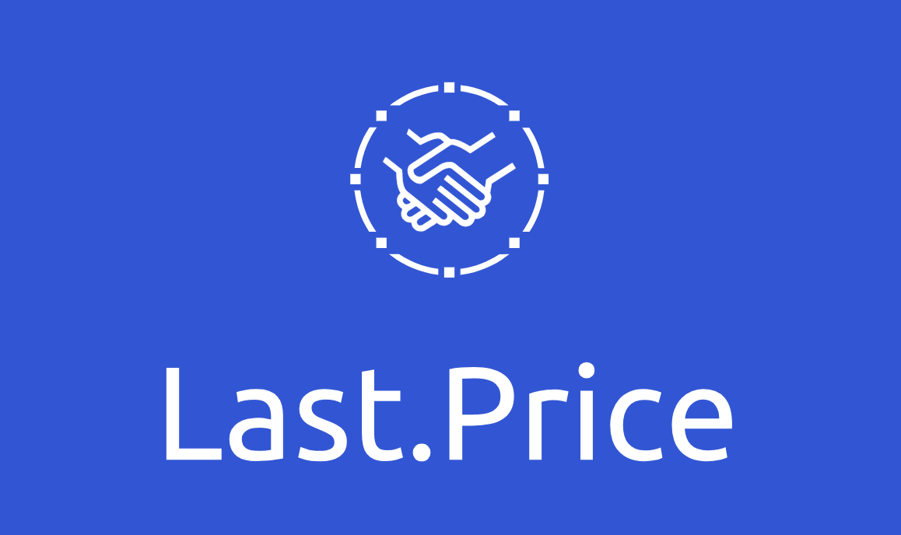
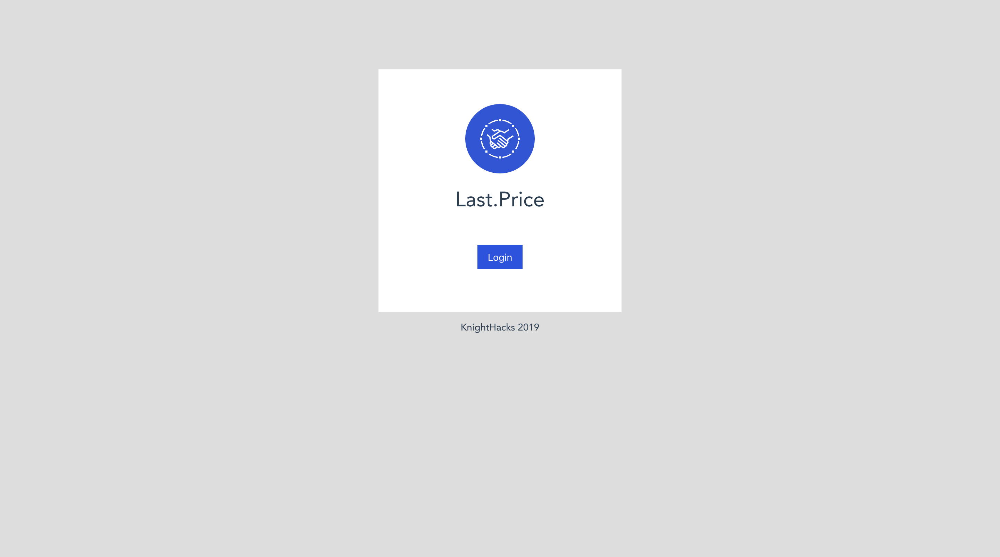
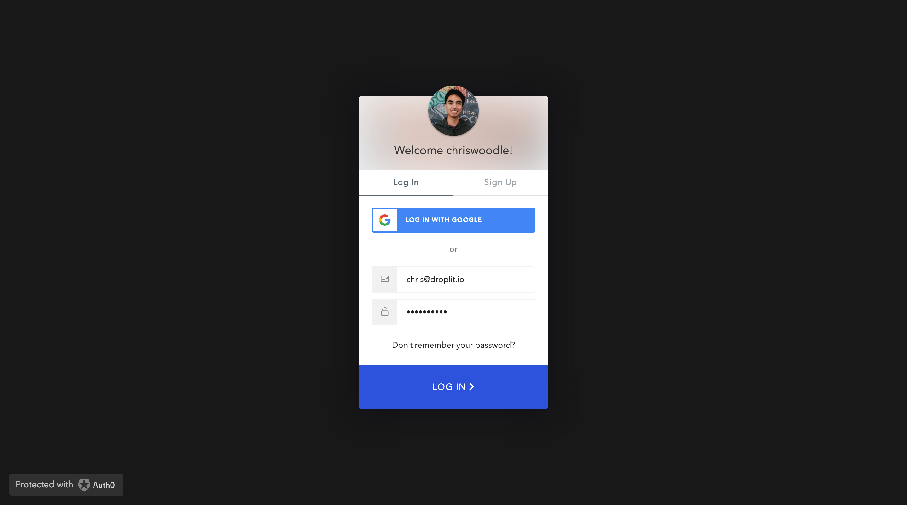

# Last.Price



*A project made at KnightHacks2019.*

# Screenshots




## Project setup
```
yarn install
```

### Compiles and hot-reloads for development
```
yarn run serve
```

### Compiles and minifies for production
```
yarn run build
```

### Customize configuration
See [Configuration Reference](https://cli.vuejs.org/config/).

# Auth0Rule
To expose auth0 metadata in the idToken

// https://community.auth0.com/t/how-to-retrieve-user-metadata-in-the-id-token/6667/9
```js
function (user, context, callback) {
  var namespace = 'https://woodle.ngrok.io/';
  if (context.idToken && user.user_metadata) {
    context.idToken[namespace + 'user_metadata'] = user.user_metadata;
  }
  if (context.idToken && user.app_metadata) {
    context.idToken[namespace + 'app_metadata'] = user.app_metadata;
  }
  callback(null, user, context);
}
```

# References 

> Generated from Vue cli (`vue create hello-world`)

https://auth0.com/docs/quickstart/spa/vuejs/01-login